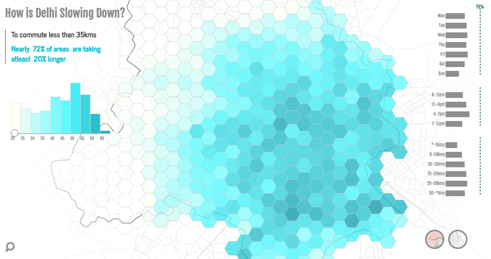

## How is Delhi Slowing Down?
#### Visualizing the extent of congestion on the roads of Delhi, the capital city of India.

### Presentation
[CLICK HERE](http://www.tinyurl.com/msdv-pres)

### Abstract
Congestion on roads in urban cities is a common phenomenon and also regarded sometimes as the hallmark of vibrant business districts. But when it comes to Delhi, the capital city of India, it is a point of major concern with studies forecasting speeds of 5 kmph on all major roads in the next five years. Road density has already reached saturation level and more and more vehicles are added every day on the streets of Delhi. Looking at the severity of the situation, there is less scope for long term planning and what is needed is an exhaustive analysis from multiple perspectives. This project aims to collect and use big data to carry out granular analysis at scale in terms of congestion or excess time faced by different areas and routes. It is both visual and analytical, where the former is carried out using spatial representation that can bring forward unknown relationships. The outcome is a tool that can be used by urban planners and analysts who can combine or filter multiple variables to understand patterns behind congestion across the city.

### Thesis Draft
[SEE HERE](https://docs.google.com/document/d/13JJJJHjDaktTiu8F4YQbtXkYz0Dk4p7SwXnuPv4q9Qs/edit)

### Feature List
Visualize the extent of congestion using three different perspectives
1. Excess commute time in different areas
2. Variation of excess commute time on different routes
3. Select a custom area (one hex cell) or a route and see excess time variation for it.

Each feature would further have a set of sub features described below
1. Variation of excess time for different days of week (bar chart)
2. Variation of excess time for different times of a day (bar chart)
3. Variation of excess time for different trip length (bar chart)
4. Show the actual areas/routes on a spatial map.
5. For 1 & 2 above a slider component will be shown to filter areas/routes above a certain cut off value.
6. Able to bring a lens of other map features to understand the underlying urban terrain. These can be two types
  1. Road structure (local roads, highways etc)
  2. Landuse (commercial, residentials etc)

Other micsellaneous features
1. Ability to pinch and zoom the spatial representation.
2. Qualitative statement accompanying every selected filter/perspective briefly explaining the current statistic.
